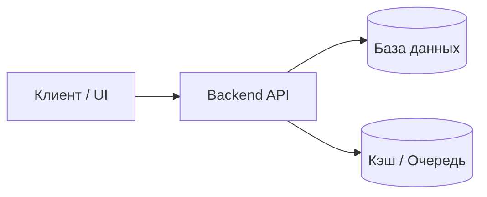

# Архитектура проекта

## Краткий обзор
Описание назначения системы, ключевых компонентов и границы ответственности (1-2 абзаца).

## Карта каталогов
```
/
├── src/            # Исходный код приложения
├── tests/          # Модульные и интеграционные тесты
├── docs/           # Архитектурная документация и ADR
│   ├── architecture/
│   └── decisions/
└── scripts/        # Утилиты автоматизации и CI/CD
```

## Ключевые сервисы и потоки данных

