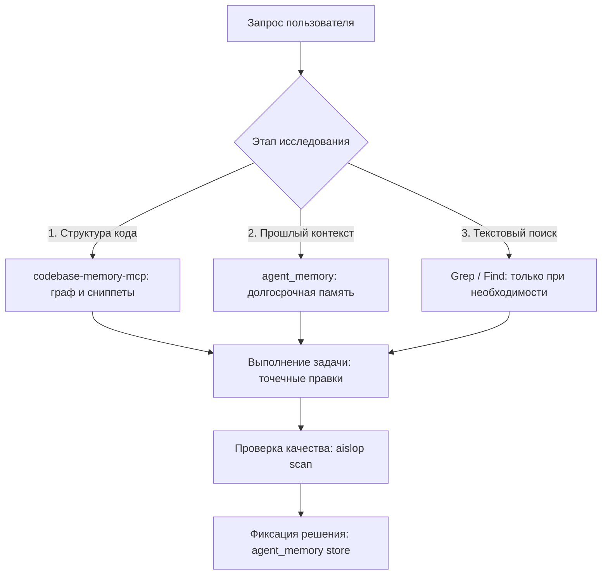

# Архитектура и экосистема MCP-инструментов

## Роли ключевых серверов

| MCP-сервер | Роль | Основные инструменты | Когда использовать |
|---|---|---|---|
| **codebase-memory-mcp** | Навигация по коду, граф связей | `search_graph`, `trace_path`, `get_code_snippet` | **Первый приоритет** при любом поиске функций, классов, типов и вызовов |
| **agent_memory** | Долгосрочная память (SQLite) | `store_memory`, `search_memory`, `list_memories` | Фиксация архитектурных решений, поиск прошлых договорённостей и готовых реализаций |
| **aislop** | Контроль чистоты кода | `aislop_scan` | Проверка отсутствия AI-шлака, мертвых абстракций и подавленных ошибок |

---

## Принцип работы триады

## Правило минимизации серверов
1. Подключайте специализированные серверы (Figma, DevTools, Firecrawl) **только локально** в тех проектах, где они требуются прямо сейчас.
2. Не держите в глобальной конфигурации более 3–4 постоянно активных MCP.
