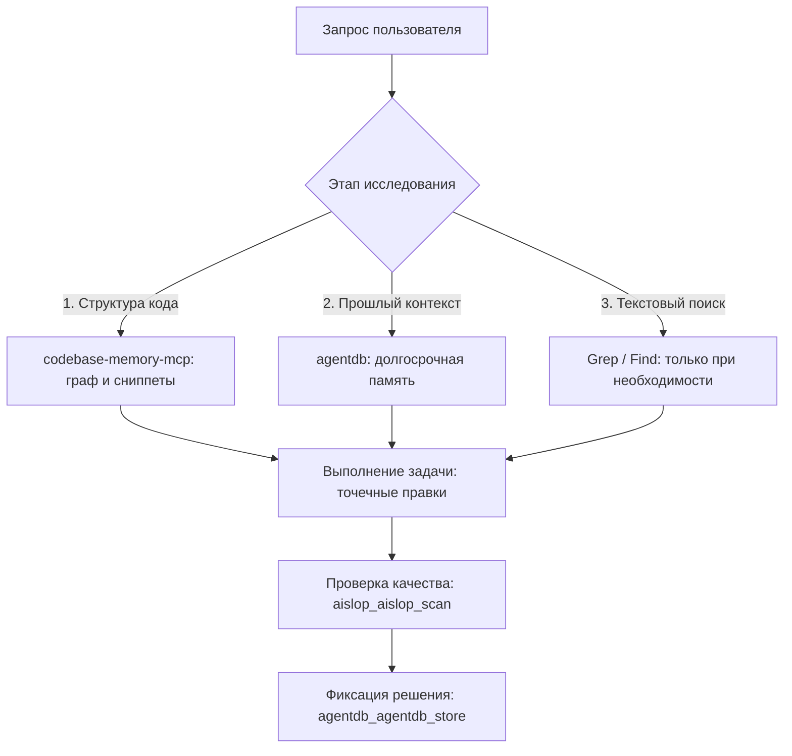

# Архитектура и экосистема MCP-инструментов

## Роли ключевых серверов

| MCP-сервер | Роль | Основные инструменты | Когда использовать |
|---|---|---|---|
| **codebase-memory-mcp** | Навигация по коду, граф связей | `codebase-memory-mcp_search_graph`, `codebase-memory-mcp_trace_path`, `codebase-memory-mcp_get_code_snippet` | **Первый приоритет** при любом поиске функций, классов, типов и вызовов |
| **agentdb** | Долгосрочная память (SQLite) | `agentdb_agentdb_store`, `agentdb_agentdb_search`, `agentdb_agentdb_list` | Фиксация архитектурных решений, поиск прошлых договорённостей и готовых реализаций |
| **aislop** | Контроль чистоты кода | `aislop_aislop_scan` | Проверка отсутствия AI-шлака, мертвых абстракций и подавленных ошибок |

---

## Принцип работы триады

```mermaid
flowchart TD
    UserQuery[Запрос пользователя] --> SearchPhase{Этап исследования}
    SearchPhase -->|1. Структура кода| Codebase[codebase-memory-mcp: граф и сниппеты]
    SearchPhase -->|2. Прошлый контекст| Memory[agentdb: долгосрочная память]
    SearchPhase -->|3. Текстовый поиск| Grep[Grep / Find: только при необходимости]
    
    Codebase --> Execution[Выполнение задачи: точечные правки]
    Memory --> Execution
    Grep --> Execution
    
    Execution --> QualityCheck[Проверка качества: aislop_aislop_scan]
    QualityCheck --> StoreDecision[Фиксация решения: agentdb_agentdb_store]
```

## Graceful degradation (бандл)

`agentdb` (память) и `codebase-memory-mcp` (граф кода) — **внешние** серверы, в бандл не входят и установщик их не ставит. `aislop` — наоборот **завендорен** (`tools/aislop/dist/`).

- Если инструментов `agentdb_agentdb_*` нет в списке — работай без долгосрочной памяти, не выдумывай её наличие, в конце сессии предложи подключить сервер.
- Если нет `codebase-memory-mcp_search_graph`/`codebase-memory-mcp_trace_path` — падай назад на текстовый поиск (grep/glob), это штатный слой 3.
- Если нет `aislop_aislop_scan` — используй вендорный CLI: `node ~/.agent-templates/tools/aislop/dist/cli.js scan`.

## Проверка доступности инструментов

- Доступность тулза доказывается вызовом, а не сличением сигнатур: если скилл описывает имя, которого нет в твоём туллисте, — сначала посмотри фактический список инструментов и попробуй ближайший аналог (напр. `agentdb_agentdb_status` для проверки живой базы), и только потом заявляй о недоступности.

## Правило минимизации серверов
1. Подключайте специализированные серверы (Figma, DevTools, Firecrawl) **только локально** в тех проектах, где они требуются прямо сейчас.
2. Не держите в глобальной конфигурации более 3–4 постоянно активных MCP.
